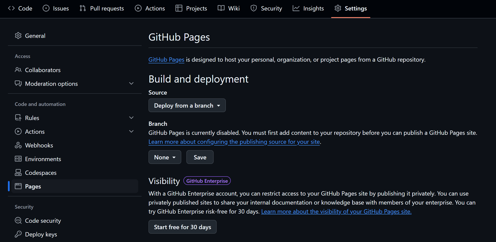

要使用GitHub Pages服务部署静态网站，首先要创建一个GitHub仓库。默认情况下，如果你的仓库名字是`<username>.github.io`，那么你的网站将会被部署到`https://<username>.github.io`。否则，你的网站将会被部署到`https://<username>.github.io/<repository-name>`。举个例子，假如你的GitHub用户名是`john`，那么仓库`john.github.io`将会被部署到`https://john.github.io`，而仓库`my-website`将会被部署到`https://john.github.io/my-website`。当然，你也可以在设置中使用自定义域名。

创建完仓库之后，要在仓库的设置中启用GitHub Pages（参见下图）。这里Source有两个选项："GitHub Actions"和"Deploy from a branch"。如果选择后者，那么GitHub Pages会直接将指定分支的内容作为网站源代码。这个选项比较直观，我一般就用这个。



如果你的网站是完全手写的，那么直接将网站内容上传到main分支，然后选择从main分支部署即可。但很多时候，网站是通过静态网站生成器生成的，这种情况下，如果手动上传生成的网站内容，就会比较麻烦。这时候，我们可以使用GitHub Actions来自动化这个过程。主要流程是：将生成网站的代码放在main分支下，然后通过GitHub Actions执行main分支，将生成的网站内容更新到gh-pages分支，最后选择从gh-pages分支部署网站。

下面是我使用的一个GitHub Actions配置文件，它会在main分支有新的commit时，自动执行`npm run build`，然后将生成的`dist`目录下的网站内容推送到gh-pages分支。

```yaml
name: Deploy to GitHub Pages

on:
  push:
    branches:
      - main
  workflow_dispatch:

jobs:
  build:
    runs-on: ubuntu-latest
    # Grant write permissions to GITHUB_TOKEN
    permissions:
      contents: write

    steps:
      - name: Checkout code
        uses: actions/checkout@v2

      - name: Set up Node.js
        uses: actions/setup-node@v2
        with:
          node-version: '20'

      - name: Install dependencies
        run: npm install

      - name: Build the project
        run: npm run build

      # Commit the generated files in the `dist` directory of the `main` branch
      # to the `gh-pages` branch
      - name: Deploy to GitHub Pages
        uses: peaceiris/actions-gh-pages@v3
        with:
          github_token: ${{ secrets.GITHUB_TOKEN }}
          publish_dir: ./dist
```
